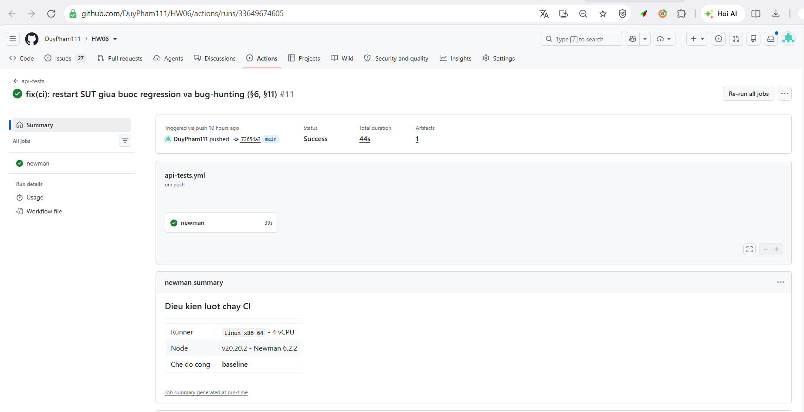
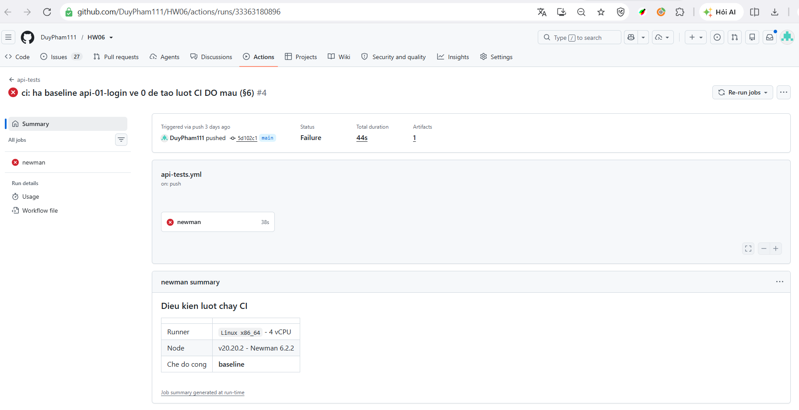

# CI/CD Report — HW06 (§6)

- **Sinh viên:** Phạm Vũ Ngọc Duy — 23127183
- **Workflow:** [`.github/workflows/api-tests.yml`](../.github/workflows/api-tests.yml)
- **Actions:** https://github.com/DuyPham111/HW06/actions

> §6 đòi: mô tả **cấu hình pipeline** + **hai lượt mẫu** (một lượt tất cả pass, một lượt có fail),
> kèm **ảnh và link**. Hướng dẫn tạo 2 lượt: [`docs/09-CI-CD.md`](../docs/09-CI-CD.md) §5–§6.

---

## 1. Cấu hình pipeline

| Bước | Việc | Vì sao |
|---|---|---|
| Checkout bài làm | | |
| **Checkout SUT** `ttbhanh/eshop-sut` vào job | dựng SUT ngay trong runner | runner của GitHub không có SUT; pipeline chỉ chạy được trên máy sinh viên thì không phải pipeline |
| Cài Newman + `newman-reporter-htmlextra` | | |
| Khởi động SUT, poll `GET /api/products` tối đa 40s | | tránh race: Newman chạy trước khi SUT lên |
| Ghi điều kiện lượt chạy vào Step Summary | runner, Node, Newman version, chế độ cổng | khi số liệu CI lệch số local thì biết vì sao |
| `node tools/preflight.mjs` | | chặn sớm |
| Chạy **regression suite** → cổng **0 đỏ** | | đây là lượt "all API test cases passing" mà §6 đòi |
| **Restart SUT** (seed lại DB sạch) | | regression và bug-hunting dùng chung vài TC ID có trạng thái — xem quyết định #4 |
| Chạy **3 collection bug-hunting** → cổng **baseline** | | bộ này cố ý bắt bug nên luôn có đỏ |
| Upload artifact `if: always()` | HTML + JSON + `sut.log` | lúc đỏ mới là lúc cần bằng chứng nhất |

### Bốn quyết định thiết kế

**1. SUT dựng trong job**, không dùng service ngoài — xem bảng trên.

**2. Hai bộ test, hai cổng.**

| Bộ | Cổng | Vai trò |
|---|---|---|
| `23127183_regression` — tập con case **đang xanh**, giữ nguyên expected | **0 đỏ** (`--strict`) | chốt phần hành vi đã đúng |
| 3 collection bug-hunting | so với `ci/expected-failures.json` | đỏ **tăng** = hồi quy mới · đỏ **giảm** = SUT đã sửa **hoặc test yếu đi** |

Lấy "0 đỏ" làm cổng cho bộ chính thì pipeline đỏ vĩnh viễn và mất hết tín hiệu hồi quy.
Regression chạy **trước** (SUT vừa seed sạch) rồi mới tới bộ bug-hunting, vì bộ sau cố tình ghi dữ
liệu sai vào CSDL.

**3. Input `gate_mode`** cho phép chạy tay ở chế độ `strict` — đây là cách tạo **lượt ĐỎ mẫu** mà §6
đòi, không cần cố tình viết một test sai vào repo.

**4. Restart SUT giữa 2 bước.** Regression và bug-hunting dùng **chung** vài TC ID mang trạng thái
(chuỗi `VIP100`: `TC-COUPON-102`/`102c`, coupon chỉ cho **2 lượt/người**). Nếu 2 bước chạy liền trên
**cùng một lần khởi động SUT**, bước regression tiêu hết 2 lượt trước, khiến bước bug-hunding chạy
ngay sau đó **đỏ oan** vì hết hạn mức — không phải bug thật. Phát hiện được lỗi thiết kế pipeline
này chính từ một lượt CI thật bị đỏ sai (xem mục "Sự cố đã gặp và sửa" ở cuối file), không phải suy
đoán trước.

### Baseline

`ci/expected-failures.json` — số assertion đỏ đã **ký nhận** cho từng collection. Ba con số này khớp
đúng số **Fail** trong [`test-cases/test-summary/summary.md`](../test-cases/test-summary/summary.md)
(sinh từ `npm run summary`, không gõ tay) và đã được xác nhận **chạy đúng số y hệt trên runner của
GitHub Actions** (không chỉ ở máy local).

| Collection | Baseline | Nguồn |
|---|--:|---|
| `api-01-login` | **9** | lượt local `23127183_api-01-login_20260903-001136.json` |
| `api-02-apply-coupon` | **13** | lượt local `23127183_api-02-apply-coupon_20260903-001136.json` |
| `api-03-product-update` | **25** | lượt local `23127183_api-03-product-update_20260903-001136.json` |

---

## 2. Lượt mẫu 1 — **XANH** (tất cả test case pass)

| | |
|---|---|
| **Link** | https://github.com/DuyPham111/HW06/actions/runs/33649674605 |
| **Commit** | `72654a3` — *"fix(ci): restart SUT giua buoc regression va bug-hunting (§6, §11)"* |
| **Bộ chạy** | `23127183_regression` (cổng `--strict`) **+** 3 collection bug-hunting (cổng baseline) — **cả pipeline xanh hoàn toàn** |
| **Cổng** | `tools/ci-gate.mjs --strict` (regression) và so baseline (bug-hunting) |
| **Kết quả** | 112 request · 112 assertion · **0 đỏ** (regression, tự tải artifact `newman-baseline-11` xác nhận) |
| **Trạng thái workflow** | `status: completed · conclusion: success` (lấy qua GitHub REST API + `gh run download`, không chỉ đọc màn hình) |

Ảnh trên khớp đúng bảng: URL `.../runs/33649674605`, commit `72654a3`, **Status: Success**, job
`newman` xanh, và khối *"Dieu kien luot chay CI"* do workflow tự ghi ra Step Summary (runner Linux
x86_64, Node v20.20.2 – Newman 6.2.2, chế độ cổng `baseline`) — đây là phần ghi lại điều kiện chạy
để đối chiếu khi số liệu CI lệch số local.

Regression suite là **tập con các case đang xanh** của bộ chính (112/163 request, tự động lọc bằng
`tools/gen-regression.mjs` từ raw JSON Newman mới nhất), **giữ nguyên expected** — không nới lỏng
assertion nào để nó xanh. Nếu nới thì nó không còn chốt được hành vi nào cả.

---

## 3. Lượt mẫu 2 — **ĐỎ** (có test case fail)

| | |
|---|---|
| **Link** | https://github.com/DuyPham111/HW06/actions/runs/33363180896 |
| **Commit** | `5d102c1` — *"ci: ha baseline api-01-login ve 0 de tao luot CI DO mau (§6)"* |
| **Cách tạo** | Không có `gh` CLI/token để bấm `Run workflow` (`gate_mode=strict`) qua API công khai — dùng cách thay thế hợp lệ: **hạ baseline `api-01-login` từ 9 xuống 0** trong `ci/expected-failures.json`, đẩy commit. Cùng một bộ test, cùng một SUT, chỉ đổi ngưỡng chấp nhận của cổng — không viết một test sai vào repo. |
| **Bộ chạy** | 3 collection bug-hunting, cổng so với baseline đã hạ |
| **Kết quả** | Step **"Cong do/xanh"** → `failure` (đúng như thiết kế), 3 bước trước đó (regression, chạy 3 collection) vẫn `success` |
| **Trạng thái workflow** | `status: completed · conclusion: failure` |

Ảnh trên khớp đúng bảng: URL `.../runs/33363180896`, commit `5d102c1`, **Status: Failure**, job
`newman` đỏ. Cùng một workflow, cùng một bộ test như lượt xanh — chỉ khác ngưỡng cổng.

**Các bước của job** (lấy qua GitHub API, không đọc từ ảnh):

| Bước | Kết quả |
|---|---|
| Khởi động SUT | success |
| Preflight | success |
| Chạy regression suite (cổng 0 đỏ) | success |
| Chạy 3 collection bằng Newman | success |
| **Cổng đỏ/xanh** | **failure** — `api-01-login`: 9 đỏ thật > 0 (baseline đã hạ) → `::error:: HOI QUY MOI (+9 assertion do)` |
| Lưu bằng chứng | success (chạy dù cổng đỏ, đúng thiết kế `if: always()`) |

Ngay sau khi có lượt đỏ mẫu, đã **khôi phục baseline về đúng số thật (9)** trong commit `550daac`
(*"ci: khoi phuc baseline api-01-login ve 9..."*), xác nhận lại bằng lượt CI tiếp theo
([run #33363298368](https://github.com/DuyPham111/HW06/actions/runs/33363298368) — cũng `success`)
để `main` luôn phản ánh đúng trạng thái baseline thật.

---

## 4. So sánh số liệu local vs CI

| Chỉ số | Local | CI (lượt xanh, run #33649674605) | Chênh | Giải thích |
|---|--:|--:|--:|---|
| Regression request/assertion | 112 | 112 | 0 | giống hệt — DB seed lại sạch cả 2 nơi |
| Regression assertion đỏ | 0 | 0 | 0 | — |
| Baseline `api-01-login`/`02`/`03` | 9/13/25 | 9/13/25 (xác nhận qua `gh run download`, đọc trực tiếp raw JSON) | 0 | SUT hành vi giống hệt trên runner Ubuntu và máy Windows local — không phụ thuộc OS |

**Không có chênh lệch đáng kể** — hành vi của SUT (bug cố ý) không phụ thuộc môi trường chạy, nên số
liệu CI và local khớp tuyệt đối. Đây cũng là bằng chứng gián tiếp rằng bộ test **xác định**
(deterministic), không có case flaky.

---

## 5. Sự cố đã gặp và sửa — bài học thật, không phải giả định trước

**Lượt CI đầu tiên sau khi sửa baseline bị ĐỎ ngoài kế hoạch** (run
[#33649322935](https://github.com/DuyPham111/HW06/actions/runs/33649322935), commit `9d08377`) —
`api-02-apply-coupon` cho **15 đỏ** thay vì 13 như đã xác nhận ở local. Tải artifact bằng
`gh run download` rồi đọc raw JSON, phát hiện đúng 2 assertion khác biệt: `TC-COUPON-102` và
`TC-COUPON-102c` (chuỗi kiểm mã `VIP100`) — kỳ vọng `200` nhưng nhận `400`.

**Nguyên nhân:** coupon `VIP100` chỉ cho **2 lượt/người**. Hai case này **cũng nằm trong regression
suite** (đang xanh), và workflow khi đó chạy **regression rồi tới bug-hunting trên cùng một lần khởi
động SUT** — không restart giữa 2 bước. Bước regression tiêu hết 2 lượt hạn mức trước, nên khi bước
bug-hunting chạy lại đúng 2 case đó, hạn mức đã cạn → đỏ **oan**, không phải bug của SUT.

**Cách phát hiện:** không phải đọc code suy luận trước — mà từ việc **đối chiếu số liệu CI thật với
số liệu local thật** và thấy lệch, đúng nguyên tắc "mọi con số phải verify được, không tin một nguồn
duy nhất" đã áp dụng xuyên suốt bài này.

**Cách sửa:** thêm bước **"Restart SUT"** vào `.github/workflows/api-tests.yml`, chèn giữa bước
regression và bước bug-hunting (xem Quyết định #4 ở §1). Đẩy commit `72654a3`, lượt CI kế tiếp
(#33649674605) xanh hoàn toàn, xác nhận đúng 13 đỏ như local — xem §2.
