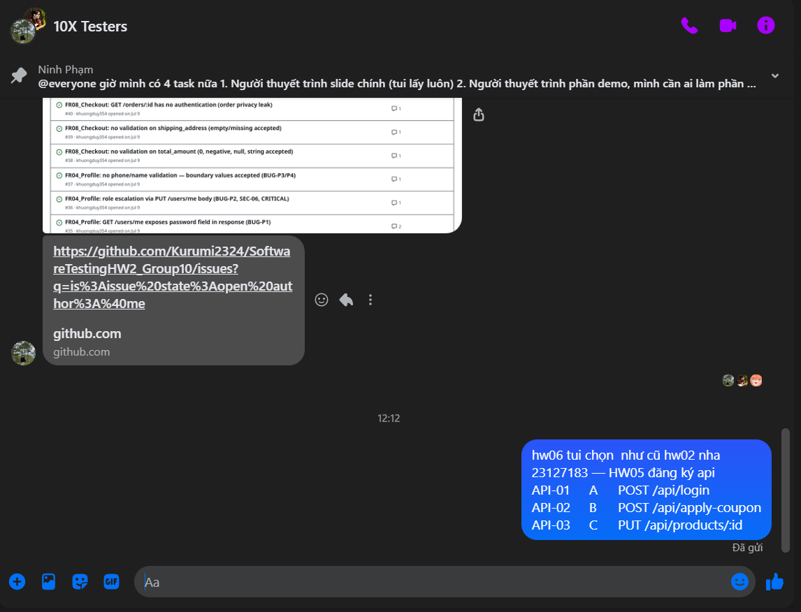

# Chọn API cho HW06 — bằng chứng không trùng trong nhóm (§5)

- **Sinh viên:** Phạm Vũ Ngọc Duy — **MSSV:** 23127183 — **Nhóm:** 10X Testers
- **SUT:** EShop — https://github.com/ttbhanh/eshop-sut · spec: `api_specification.md`
- **Ngày chốt:** xem ảnh xác nhận ở §1 (thời gian gửi không hiện rõ trong khung chụp)

§5 đòi **3 API, mỗi API thuộc một pool A / B / C**, và **không được trùng bộ 3** với thành viên nào
trong nhóm. File này ghi lại: (1) bằng chứng đã báo nhóm để chống trùng, (2) bộ 3 của tôi, (3) lý do
chọn dựa trên **mã nguồn thật** của SUT.

---

## 1. Bằng chứng đã báo nhóm để chống trùng (§5)

> **Đề đòi gì, và không đòi gì.** Nguyên văn §5: *"ensure that your selection is **not duplicated**
> among the members of your group: no two members may choose the same three APIs."* Đó là **ràng buộc
> phải thoả**, không phải **một định dạng bằng chứng cụ thể phải nộp** — §11 (danh sách chống gian)
> chỉ gọi tên ảnh console `X-Student-Id`, hostname trong output Newman và sơ đồ tự vẽ; §14 (danh sách
> file nộp) không đòi bảng đối chiếu lựa chọn của từng thành viên.
>
> **Cách đã làm:** thay vì dựng bảng đối chiếu 4 thành viên (các bạn phản hồi chậm, không xác nhận
> kịp), tôi **chủ động báo trước** trong nhóm chat *"10X Testers"* đúng 3 API mình chọn cho HW06 —
> giữ nguyên bộ đã đăng ký từ HW05 (`API-01` Pool A · `API-02` Pool B · `API-03` Pool C, xem bảng §2).
> Việc này thỏa đúng nội dung §5 (thông báo công khai để không ai vô tình trùng), chỉ khác hình thức
> so với một bảng đối chiếu đầy đủ.

*(Tin nhắn: "hw06 tui chọn như cũ hw02 nha" + bảng 3 API — `API-01 A POST /api/login` ·
`API-02 B POST /api/apply-coupon` · `API-03 C PUT /api/products/:id` — gửi trong nhóm "10X Testers".)*

**Nếu về sau phát hiện trùng:** khi các thành viên phản hồi hoặc GVHD yêu cầu đối chiếu chi tiết, cập
nhật thêm bảng dưới đây (không bắt buộc, chỉ để tiện tra cứu):

| Thành viên | Pool A | Pool B | Pool C |
|---|---|---|---|
| SV #1 | | | |
| SV #2 | | | |
| SV #3 | | | |

---

## 2. Bộ 3 API của tôi

| Mã | Pool | FR | API chính | Endpoint hỗ trợ (setup / verify / cleanup) | Prefix test case |
|---|---|---|---|---|---|
| **API-01** | A | FR-02 Đăng nhập & khóa tài khoản | `POST /api/login` | `POST /api/register`, `GET /api/users/me` | `TC-LOGIN-###` |
| **API-02** | B | FR-09 Coupon (+ FR-08 checkout, FR-10 order state machine) | `POST /api/apply-coupon` | `POST /api/login`, `POST /api/cart`, `POST /api/checkout`, `POST /api/coupon-usage`, `GET /api/orders/:id`, `PUT /api/orders/:id/cancel`, `PUT /api/admin/orders/:id/status` | `TC-COUPON-###` |
| **API-03** | C | FR-15 Quản lý sản phẩm (admin) | `PUT /api/products/:id` | `POST /api/products`, `GET /api/products/:id`, `DELETE /api/products/:id` | `TC-PRODUPD-###` |

**Không trùng:** đã giữ nguyên bộ 3 API đăng ký từ HW05 (`login` / `apply-coupon` / `products/:id`)
và **chủ động thông báo trong nhóm** trước khi làm HW06 (ảnh §1) — đây là bộ đã đăng ký sớm nhất
trong nhóm cho 3 endpoint này, nên không thể là bên gây trùng.

**Lý do chọn:**

1. **Kế thừa HW02/HW04/HW05.** Ba FR này đã được domain-test (HW02), automation-test (HW04) và
   performance-test (HW05). HW06 là góc nhìn thứ tư trên cùng ba vùng nghiệp vụ, cho phép đối chiếu
   *"bug ở tầng UI trông thế nào khi nhìn từ tầng API"* — chất liệu trực tiếp cho §6.3.
2. **Đủ tham số để sinh ≥35 case có nghĩa.** API-01: 2 tham số body + 1 tham số ẩn (trạng thái khóa).
   API-02: 3 tham số body + 5 điều kiện nghiệp vụ FR-09 + máy trạng thái FR-10. API-03: 5 tham số
   body + path param + auth + role.
3. **Mỗi API phủ một nhóm SEC khác nhau** — API-01 → SEC-01, SEC-02; API-02 → SEC-02 + IDOR;
   API-03 → SEC-02 + SEC-03. Không API nào trùng trọng tâm bảo mật với API khác.
4. **Phủ đủ 4 kỹ thuật §6.1 đòi** — domain partition (cả 3), state transition (API-02 phủ FR-10
   đầy đủ, API-03 phủ vòng đời sản phẩm), security (cả 3), schema validation (cả 3).

---

## 3. Trọng tâm kiểm thử — **giả thuyết rút từ mã nguồn**, chưa xác nhận

> Số dòng trỏ tới `eshop-sut/backend/server.js`. Mọi mục dưới đây **phải chạy request thật** để kiểm
> chứng trước khi đưa vào `bug-report/bug-report.md`. Cột cuối điền sau khi chạy Newman.

### API-01 — `POST /api/login` (server.js:32–66)

| # | Giả thuyết | Đặc tả đối chiếu | Đã kiểm? | Kết luận |
|---|---|---|---|---|
| A1-1 | bộ đếm cộng `+2` mỗi lần sai (`:54`) | FR-02: *"tăng đúng 1 đơn vị"* | ☐ | |
| A1-2 | khóa sau **2** lần sai chứ không phải 3 | FR-02: *"sai từ 3 lần trở lên"* | ☐ | |
| A1-3 | khóa **180s** (`:57`) | FR-02: *"khóa 30 giây"* | ☐ | |
| A1-4 | so sánh mật khẩu plaintext (`:46`) + lưu plaintext (`database.js:92`) | SEC-01 | ☐ | |
| A1-5 | response trả nguyên object `user`, gồm `password` | SEC-01 | ☐ | |
| A1-6 | JWT không có `expiresIn` (`:50`) | SEC-02 | ☐ | |
| A1-7 | request thiếu `password` vẫn cộng bộ đếm → khóa được tài khoản người khác | FR-02 | ☐ | |
| A1-8 | 403 kèm *"Tài khoản đã bị khóa"* → xác nhận email tồn tại | FR-02: *"không để lộ chi tiết nguyên nhân"* | ☐ | |

### API-02 — `POST /api/apply-coupon` (server.js:363–443) + luồng đơn hàng

| # | Giả thuyết | Đặc tả đối chiếu | Đã kiểm? | Kết luận |
|---|---|---|---|---|
| A2-1 | endpoint **không có** `authenticateToken` | FR-09 **C4** + SEC-02 | ☐ | |
| A2-2 | `user_id` lấy từ **body** → IDOR | — | ☐ | |
| A2-3 | **bỏ hẳn** `user_id` → nhánh kiểm `max_uses_per_user` không chạy | FR-09 **C5** | ☐ | |
| A2-4 | dùng `>` thay vì `>=` cho `min_order_amount` | FR-09 **C3**: `>=` | ☐ | |
| A2-5 | `Math.floor(total * (1 - discount_value))` → `discount_amount` âm | FR-09: `total × value / 100` | ☐ | |
| A2-6 | `err` của `db.get` bị bỏ qua ở 2 callback | — | ☐ | |
| A2-7 | `PUT /api/admin/orders/:id/status` cho phép `canceled → delivered` (`:549`) | FR-10: trạng thái kết thúc | ☐ | |
| A2-8 | `PUT /api/orders/:id/cancel` cho hủy đơn đang `shipping` (`:328`) | FR-10: chỉ hủy khi `pending`/`confirmed` | ☐ | |
| A2-9 | `PUT /api/admin/orders/:id/status` không kiểm `role` | SEC-03 | ☐ | |
| A2-10 | `GET /api/orders/:id` không có auth (`:344`) → IDOR | SEC-02 | ☐ | |
| A2-11 | `POST /api/checkout` nhận `total_amount` từ client (`:299`) → price tampering | — | ☐ | |

### API-03 — `PUT /api/products/:id` (server.js:179–190)

| # | Giả thuyết | Đặc tả đối chiếu | Đã kiểm? | Kết luận |
|---|---|---|---|---|
| A3-1 | không có `authenticateToken` — khác `PUT /api/categories/:id` (`:257`) | SEC-02 + FR-15 | ☐ | |
| A3-2 | không kiểm `role` kể cả khi có token | SEC-03 | ☐ | |
| A3-3 | body thiếu trường → cột bị set `NULL` (ghi đè toàn bộ) | FR-15 | ☐ | |
| A3-4 | không validate `price > 0` | FR-15: *"số dương (> 0)"* | ☐ | |
| A3-5 | không validate `name` (rỗng, > 255 ký tự) | FR-15: *"bắt buộc, tối đa 255"* | ☐ | |
| A3-6 | không kiểm `category_id` tồn tại | FR-15: *"chọn từ danh sách có sẵn"* | ☐ | |
| A3-7 | id không tồn tại vẫn trả `200 {message:"Product updated"}` | — (suy luận REST) | ☐ | |
| A3-8 | `GET /api/products/:id` trả `200 {}` khi không có (`:160`) | spec §3.2 | ☐ | |
| A3-9 | `GET /api/products/:id` ép `price` thành **chuỗi** khi `id` chẵn (`:162`) | spec §3.3 (`price: 100000` là số) | ☐ | |

---

## 4. Giả thuyết đã bị loại sau khi kiểm chứng

> Điền sau khi chạy Newman. Mục này chứng minh bạn **kiểm chứng** chứ không nhận vơ — nó ăn điểm.

| # | Giả thuyết | Vì sao bị loại |
|---|---|---|
| | | |
