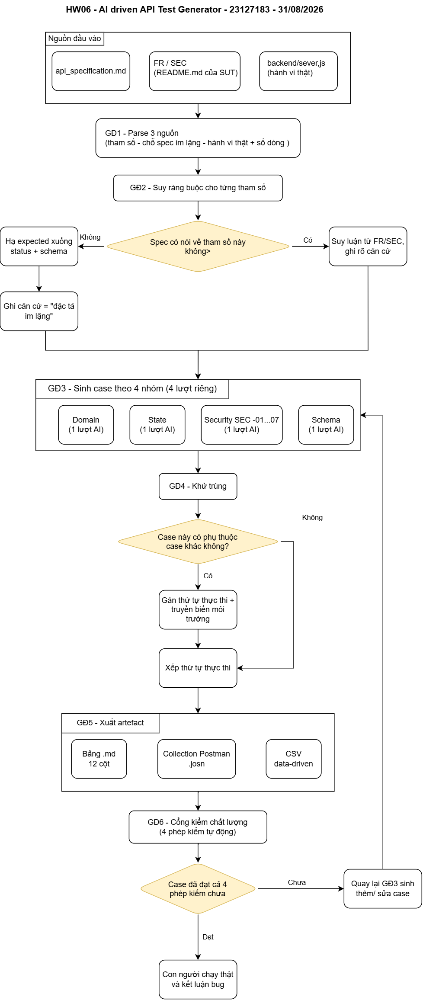

# AI-driven API Test Generator — thiết kế (§7, mức Create G9.5)

- **Sinh viên:** Phạm Vũ Ngọc Duy — 23127183
- **Bài toán:** cho **đặc tả API** của EShop, sinh ra bộ test case phủ domain partition, state
  transition, security SEC-01..07 và schema validation — tự động, nhưng **không** bằng một prompt gộp.
- **Pseudocode:** [`pseudocode.py`](pseudocode.py) · **Sơ đồ:** [`diagram/`](diagram/)
- Hướng dẫn hoàn thiện file này: [`docs/11-GENERATOR-DESIGN.md`](../docs/11-GENERATOR-DESIGN.md)

---

## 1. Bài toán

Làm tay: mỗi API mất ~4 giờ để đi hết 5 bước sinh case, và ba API thì bảng test case, collection
Postman, file CSV rất dễ lệch nhau. Generator giải quyết đúng hai chuyện đó: **quy trình lặp lại
được** và **một nguồn sinh nhiều đích**.

Ràng buộc từ đề:

- §2 cấm prompt gộp → generator phải **chia lượt**, không được gộp.
- §6.1 đòi phủ **4 nhóm kỹ thuật** trên **mọi** tham số.
- §11 cấm sơ đồ do AI vẽ → thiết kế phải do người quyết định.

## 2. Vì sao không phải "một prompt gửi cả spec"

| Cách làm | Vấn đề |
|---|---|
| Một prompt: *"sinh hết test case từ spec"* | §2 cấm đích danh. Thực tế: AI dồn về security, state chỉ còn 2–3 case cho có; và expected bị bịa ở những chỗ spec im lặng |
| Sinh xong rồi mới audit một lượt | Lỗi bịa expected lan ra 40 case, sửa tay tốn hơn là chặn từ đầu |
| **Chia 4 nhóm, mỗi nhóm một lượt, có cổng kiểm ở cuối** | Mỗi lượt có một mục tiêu duy nhất; cổng kiểm bắt lỗi trước khi lan |

## 3. Kiến trúc — 6 giai đoạn

| GĐ | Tên | Vào | Ra |
|---|---|---|---|
| 1 | **Parse 3 nguồn** | `api_specification.md` · FR/SEC (`README.md`) · `server.js` | tham số (tên, vị trí, kiểu, bắt buộc) · **danh sách chỗ spec im lặng** · hành vi thật kèm số dòng |
| 2 | **Suy ràng buộc** | GĐ1 | luật cho từng tham số · **câu hỏi mở** |
| 3 | **Sinh case theo 4 nhóm — 4 lượt riêng** | GĐ2 | 4 tập case |
| 4 | **Khử trùng + xếp thứ tự** | GĐ3 | case có ID, có thứ tự thực thi, có phụ thuộc |
| 5 | **Xuất artefact** | GĐ4 | bảng Markdown 12 cột · collection Postman `.json` · CSV data-driven |
| 6 | **Cổng kiểm chất lượng** | GĐ5 | báo cáo "case nào chưa đạt" → quay lại GĐ3 |

**Vì sao đọc 3 nguồn chứ không 1:**

| Nguồn | Cho biết |
|---|---|
| `api_specification.md` | endpoint, tham số, body mẫu, response thành công |
| FR/SEC trong `README.md` của SUT | **ràng buộc nghiệp vụ và bảo mật** — đặc tả API không có |
| `backend/server.js` | hành vi **thật**: status code thật, middleware có/không, câu SQL, số dòng |

Expected **luôn** bám hai nguồn đầu. Nguồn thứ ba dùng để **biết chỗ nào đáng chọc** — và chỗ nó
lệch với hai nguồn đầu chính là bug.

## 4. Sơ đồ

> **Sơ đồ do sinh viên tự dựng** trên _(công cụ)_, ngày __/__/2026.
> File nguồn: `diagram/generator-flow.drawio`. §11 cấm sơ đồ do AI sinh.
> Yêu cầu nội dung sơ đồ: [`docs/11-GENERATOR-DESIGN.md`](../docs/11-GENERATOR-DESIGN.md) §4.2.

## 5. Hai quyết định thiết kế đáng ghi lại

**Quyết định 1 — Generator không tự kết luận bug.**
Nó chỉ sinh case và expected kèm **căn cứ**. Việc kết luận "đây là bug" thuộc về người, sau khi chạy
thật. Lý do: một generator tự gắn nhãn bug sẽ nhân bản chính lỗi bịa expected của AI lên hàng trăm case,
và báo cáo đầy **bug giả** — thứ tệ nhất một bộ test có thể sinh ra.

**Quyết định 2 — Đầu ra là *định nghĩa case*, không phải file cuối.**
Mỗi case là một object có đủ 12 trường; bảng Markdown, collection Postman và CSV đều sinh ra **từ
object đó**. Lý do: bài này phải giữ bảng test case và collection khớp nhau ở hơn trăm case — làm tay
là chắc chắn lệch, và bảng lệch collection thì bảng thành đồ trang trí.

## 6. Pseudocode

Xem [`pseudocode.py`](pseudocode.py). Quy ước đọc: `# DECIDE:` đánh dấu chỗ **người thiết kế phải
quyết định**, và ghi luôn đã quyết định thế nào.

## 7. Giới hạn đã biết

Ghi ra để người chấm không phải tự phát hiện:

| Giới hạn | Vì sao chấp nhận |
|---|---|
| GĐ1 phụ thuộc chất lượng đặc tả — spec mơ hồ thì GĐ2 sinh ra rất nhiều "câu hỏi mở" | đó là hành vi **đúng**: thà lộ ra chỗ không biết còn hơn bịa expected |
| Không tự sinh được case đòi kiến thức tầng dưới (SQLite `LIKE` chỉ case-insensitive với ASCII) | đây đúng là nhóm **characteristics of the API** ở §6.3 — phần dành cho người |
| Không tự kết luận bug (Quyết định 1) | có chủ ý |
| Chuỗi state cần người xác nhận thứ tự | GĐ4 sinh thứ tự đề xuất, người duyệt |

## 8. Hiện thực

_(Điền theo lựa chọn của bạn — xem [`docs/11-GENERATOR-DESIGN.md`](../docs/11-GENERATOR-DESIGN.md) §6.)_

Generator được hiện thực dưới dạng **Agent Skill** tại [`.claude/skills/`](../.claude/skills/):
`api-test-design` (GĐ1–3) · `api-test-audit` (GĐ6) · `postman-newman` (GĐ5) · `ai-audit-logger` (§9).

Lựa chọn này có chủ ý: 4 giai đoạn đầu cần **suy luận trên ngôn ngữ tự nhiên** (đọc spec, nhận ra chỗ
spec im lặng), là việc LLM làm được còn parser tĩnh thì không. Giai đoạn 5–6 mới là phần thuần cơ khí
và đã được mô tả trong pseudocode.
