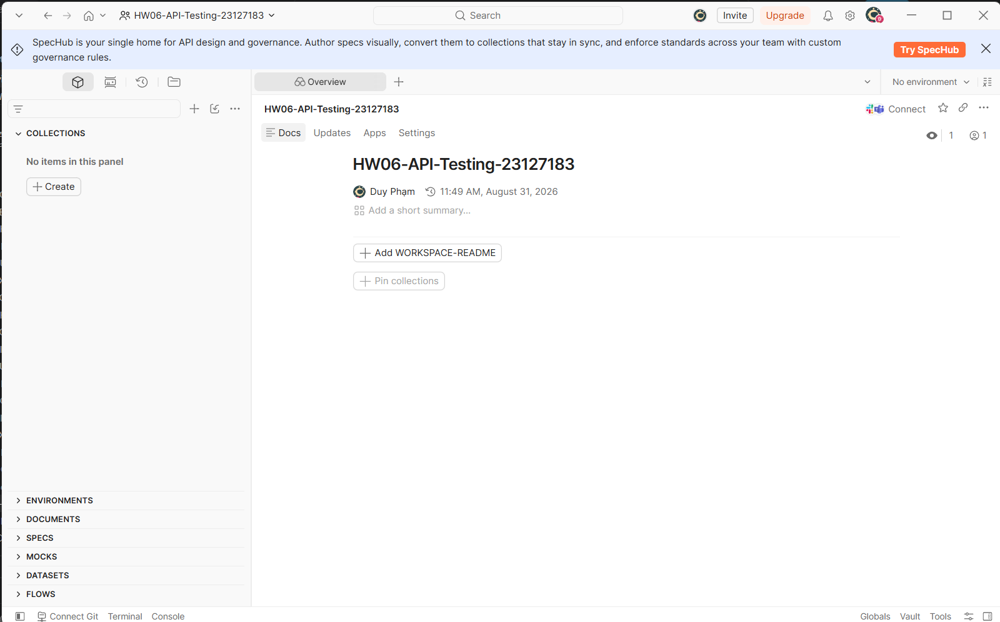
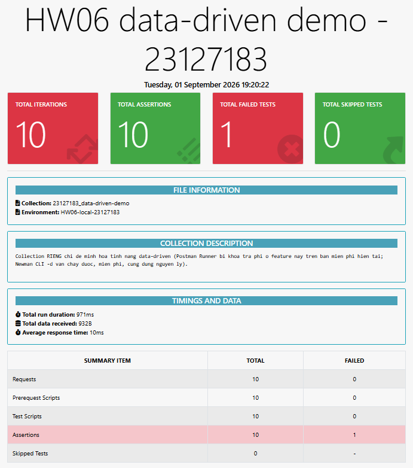
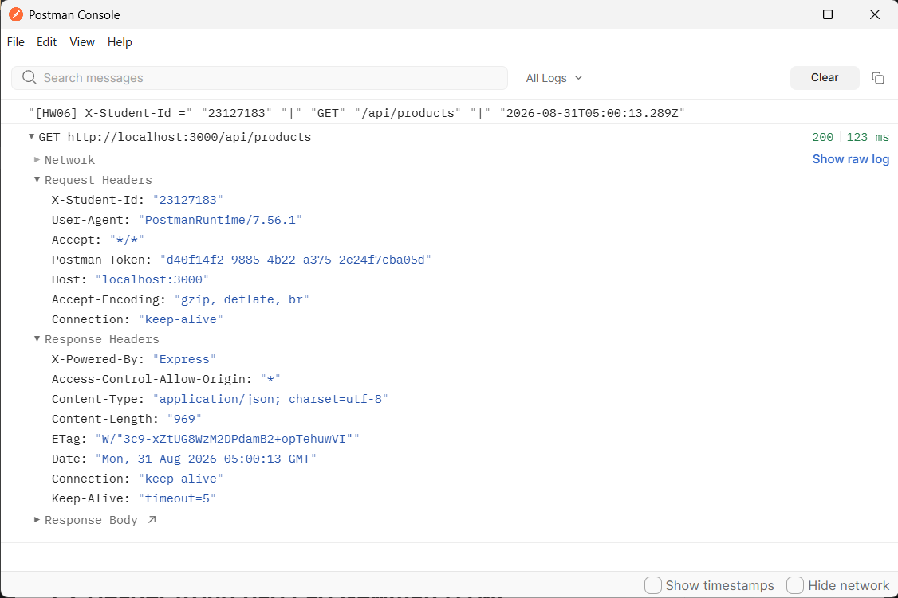
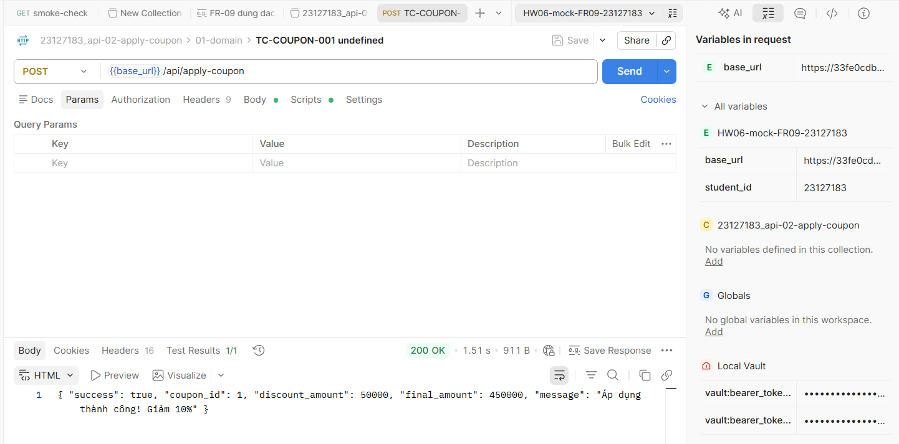
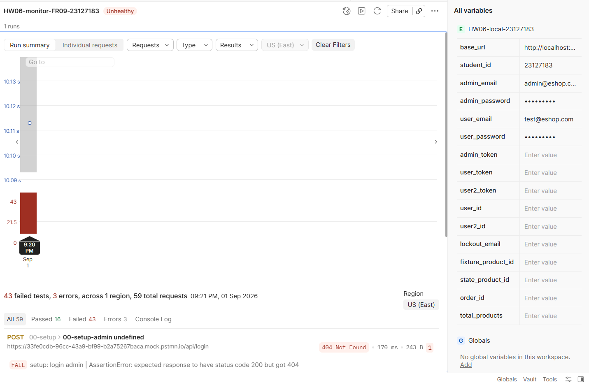

# Postman — feature đã dùng (§6, §14)

- **Sinh viên:** Phạm Vũ Ngọc Duy — 23127183
- **Workspace:** `HW06-API-Testing-23127183`
- **Environment:** [`environments/HW06-local.postman_environment.json`](environments/HW06-local.postman_environment.json)
- **Pre-request script cấp collection:** [`prerequest-collection.js`](prerequest-collection.js)

> §6: *"Exercise as many Postman features as you reasonably can… **List the Postman features you
> used in your report.**"* · §14 nhắc lại trong danh sách file nộp.
> Hướng dẫn: [`docs/08-POSTMAN-FEATURES.md`](../docs/08-POSTMAN-FEATURES.md).

---

## 1. Collection

| Collection | API | Vai trò |
|---|---|---|
| `23127183_api-01-login` | `POST /api/login` | bug-hunting |
| `23127183_api-02-apply-coupon` | `POST /api/apply-coupon` | bug-hunting |
| `23127183_api-03-product-update` | `PUT /api/products/:id` | bug-hunting |
| `23127183_regression` | tập con case đang xanh | cổng CI 0 đỏ |

Mỗi collection có 6 folder: `00-setup` · `01-domain` · `02-state` · `03-security` · `04-schema` · `99-teardown`.

---

## 2. Bảng feature đã dùng

| # | Feature | Dùng để làm gì | Bằng chứng |
|---|---|---|---|
| 1 | Workspace | `HW06-API-Testing-23127183` chứa cả 4 collection |  |
| 2 | Collections | 3 bug-hunting + 1 regression | `collections/*.json` |
| 3 | Folders | 6 folder/collection theo kỹ thuật → báo cáo Newman tự nhóm kết quả | |
| 4 | Environment | `HW06-local-23127183` — 16 biến | `environments/*.json` |
| 5 | Variables (env · collection · dynamic) | `{{base_url}}`, `{{admin_token}}`, `{{order_id}}`; `{{$randomEmail}}` cho tài khoản mồi | §3 dưới |
| 6 | Secret variable type | mật khẩu và token đặt type `secret` | |
| 7 | **Pre-request script cấp collection** | gắn `X-Student-Id` cho **mọi** request + log Console (§6.4, §11) | `prerequest-collection.js` |
| 8 | Post-response script / `pm.test` | toàn bộ assertion | mọi request |
| 9 | JSON Schema validation | folder `04-schema` — §6.1 đòi *"response shape exactly matches the spec"* | §3 dưới |
| 10 | Data-driven (CSV) | §6 gọi tên đích danh. Runner GUI của Postman hiện khoá tính năng "Datasets and data files" vào gói trả phí — dùng **Newman CLI `-d`** thay thế (cùng cơ chế, miễn phí, §8 liệt kê Newman ngang Postman) | `data/coupon-cases.csv` (10 dòng) · collection riêng `23127183_data-driven-demo.postman_collection.json` · báo cáo thật `reports/newman/23127183_data-driven-demo.html` (10 iteration, bắt được BUG-12) · ảnh:  |
| 11 | Postman Console | bằng chứng §11 |  |
| 12 | Newman CLI + `htmlextra` | chạy ngoài GUI, xuất HTML + raw JSON | `../reports/newman/` |
| 13 | Newman trong CI (GitHub Actions) | §6 CI/CD | `../.github/workflows/api-tests.yml` |
| 14 | Mock Server | minh hoạ assertion FR-09 đúng chiều (BUG-10) — xem §4 | `https://33fe0cdb-96cc-43a9-bf99-b2a75267baca.mock.pstmn.io` ·  |
| 15 | Monitor | giám sát collection mock (cloud-to-cloud, không cần SUT local) — xem §4 |  |

---

## 3. Trích script tiêu biểu

### 3.1 Pre-request cấp collection — `X-Student-Id` (§6.4, §11)

```js
const studentId = pm.environment.get("student_id") || "23127183";
pm.request.headers.upsert({ key: "X-Student-Id", value: studentId });
console.log("[HW06] X-Student-Id =", studentId, "|", pm.request.method,
            pm.request.url.getPath(), "|", new Date().toISOString());
```

Đặt ở **cấp collection**, không gắn tay từng request: hơn trăm request, sót một cái là mất bằng
chứng §11 cho request đó.

### 3.2 JSON Schema validation

```js
// (dán assertion thật của bạn)
```

`additionalProperties: false` là chỗ bắt lỗi **trả thừa dữ liệu** (SEC-01 — response chứa `password`).

### 3.3 Data-driven

```js
// (dán assertion thật của bạn)
```

---

## 4. Mock Server và Monitor

### Mock Server

**Mục đích:** chứng minh assertion viết **đúng chiều**. SUT trả `discount_amount` sai công thức
(BUG-10) nên assertion FR-09 đỏ khi chạy trên SUT thật. Chạy **cùng assertion đó** (cùng case
`TC-COUPON-001`, cùng collection `23127183_api-02-apply-coupon`) lên một mock trả đúng đặc tả → nó
xanh ⇒ xác nhận đỏ là do **SUT sai**, không phải do assertion viết sai.

| | |
|---|---|
| URL mock | `https://33fe0cdb-96cc-43a9-bf99-b2a75267baca.mock.pstmn.io` (Public) |
| Nguồn mock | Example `FR-09 dung dac ta` gắn trên request `TC-COUPON-001` (folder `01-domain`), deploy từ `23127183_api-02-apply-coupon` |
| Environment | `HW06-mock-FR09-23127183` (Postman tự tạo khi deploy mock, biến `base_url` trỏ sẵn vào URL trên) |
| Kết quả | Gửi `TC-COUPON-001` qua environment mock → **`200 OK`**, `discount_amount: 50000`, `final_amount: 450000` (đúng công thức FR-09: `500.000 × 10 / 100`) — **Test Results 1/1 pass**, khớp đúng dự đoán |
| Ảnh |  |

### Monitor

Đã tạo monitor cho **chính collection mock** ở trên (không phải bộ test chính — bộ test chính chạy
trên `localhost`, cloud của Postman không với tới, và §11 cũng đòi hostname Newman phải là
`localhost`/`127.0.0.1` nên monitor không dùng cho bộ đó).

| | |
|---|---|
| Tên | `HW06-monitor-FR09-23127183` |
| Collection | `23127183_api-02-apply-coupon` |
| Environment | `HW06-mock-FR09-23127183` |
| Tần suất | hàng tuần |
| Kết quả lượt chạy đầu | Trạng thái tổng **"Unhealthy"** — 59 request, 16 pass, 43 fail, 3 error |
| Ảnh |  |

**Vì sao "Unhealthy" — và vì sao đó là kết quả đúng, không phải lỗi:** monitor chạy **toàn bộ**
collection `23127183_api-02-apply-coupon` (57+ request ở cả 4 folder `00-setup`…`04-schema`) lên
mock, nhưng mock **chỉ có đúng 1 example** được định nghĩa (cho `TC-COUPON-001`). Với mock server của
Postman, request nào không khớp example nào thì nhận **404 "not found"** mặc định — nên gần như toàn
bộ 56 request còn lại (setup login, các case khác, chuỗi state...) đỏ vì **thiếu example**, không
phải vì mock sai. Request duy nhất có ý nghĩa để đọc — `TC-COUPON-001` — vẫn `200` đúng công thức
như bảng trên. Không mở rộng thêm example cho các case khác vì mục đích của mock chỉ là minh hoạ
**1 case cụ thể** (BUG-10), không phải giả lập toàn bộ SUT.

---

## 5. Feature đã cân nhắc nhưng **không** dùng

| Feature | Vì sao không dùng |
|---|---|
| Postman Flows | bộ test này tuyến tính; Flows không thêm khả năng kiểm nào mà lại làm collection khó xuất `.json` cho CI |
| Public workspace | collection chứa mật khẩu tài khoản seed → để Personal |
| Postman API (quản lý collection bằng API) | chỉ 4 collection, export tay là đủ |
